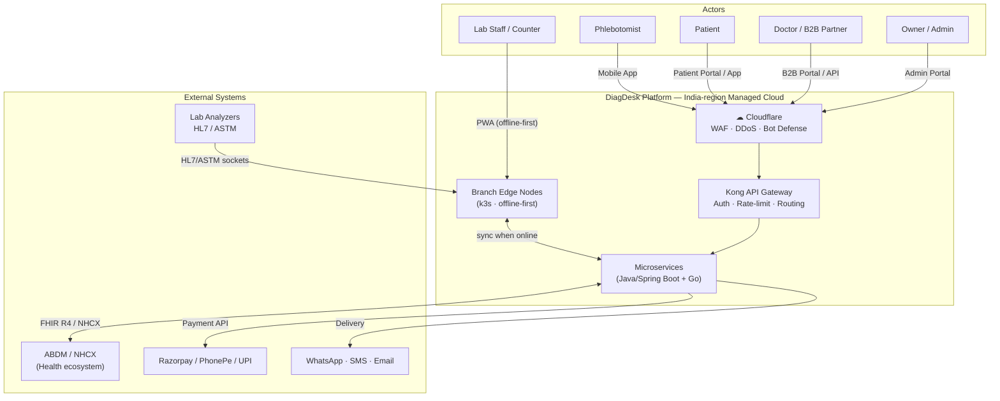
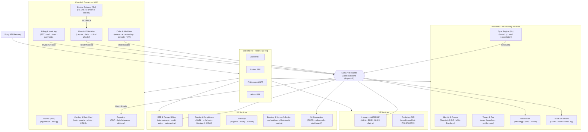
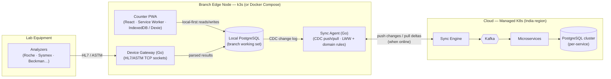
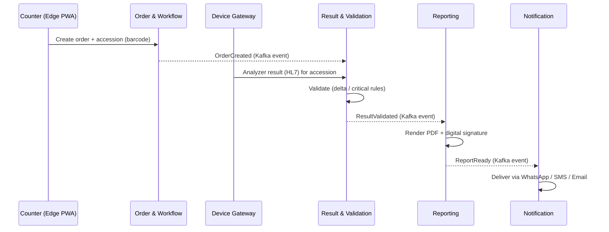
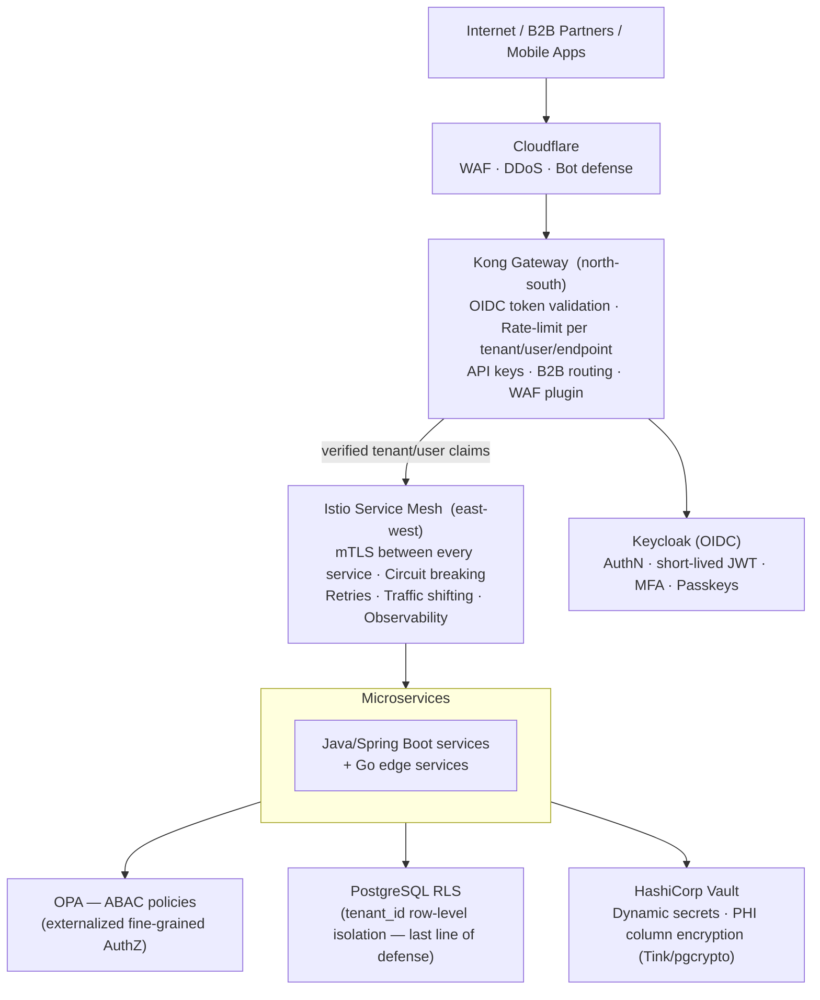
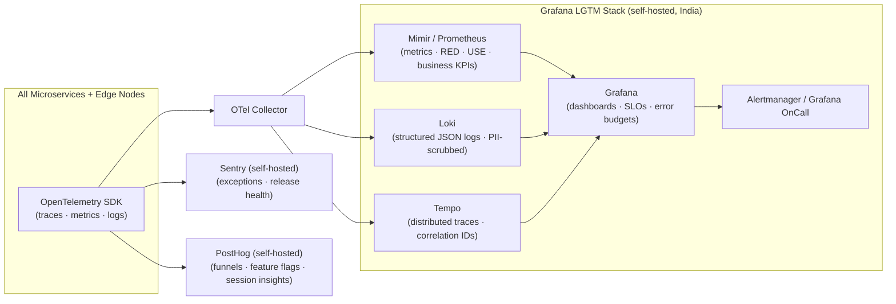
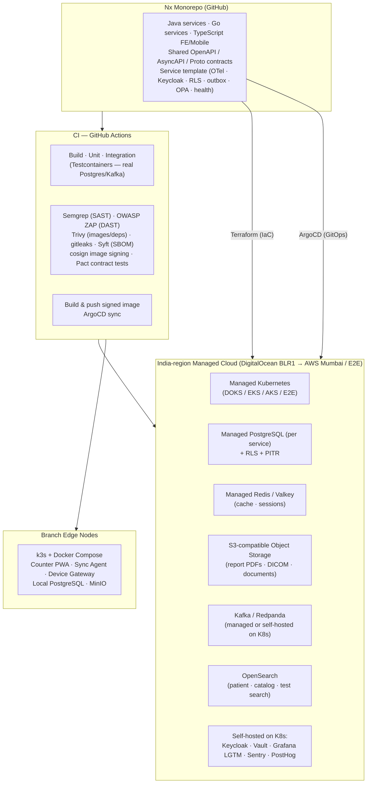

# DiagDesk — Architecture Diagram

*Synthesized from `technical-architecture.md` and `tech-stack.md`. Render with any Mermaid-capable viewer.*

---

## 1. System Context (C4 Level 1)

---

## 2. Container View — Microservices & Data Flow (C4 Level 2)

---

## 3. Branch Edge Node — Offline-First Architecture

---

## 4. Request Flow — Order → Report → Delivery (Sequence)

---

## 5. Security & Traffic Layers

---

## 6. Observability Stack

---

## 7. Infrastructure & Delivery

---

## 8. Phase Build Order

| Phase | Timeframe | What ships |
|---|---|---|
| **Foundation** | Pre-MVP | Nx monorepo · service template · Kong · Keycloak · Vault · Postgres+RLS · Kafka · OTel→Grafana · CI/CD with security scans · Edge node + Sync Engine skeleton |
| **MVP** | 0–4 months | Identity · Tenant · Patient MPI · Catalog/Rate-Card · Order/Workflow · Result · Device Gateway · Reporting · Billing · Notification · Audit/Consent — all offline-capable |
| **V1** | 4–8 months | B2B & Partner Billing · Quality & Compliance · Inventory · Booking & Home-Collection · MIS/Analytics |
| **V2** | 8–14 months | Interop (ABDM HIP/FHIR/NHCX) · Radiology RIS + PACS/DICOM |
| **V3** | North star | MediCircle — five-sided platform (Doctors · Pharmacies · Home-Care · Patients + DiagDesk lab node) |
