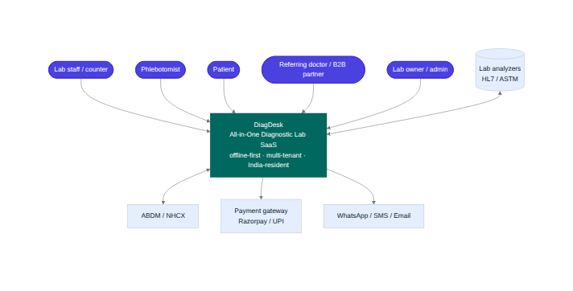
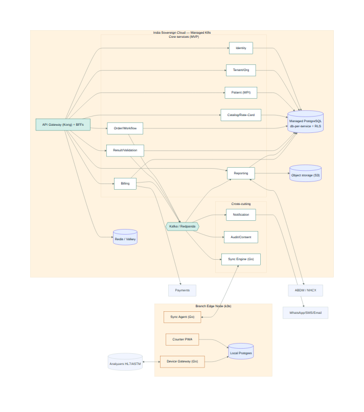
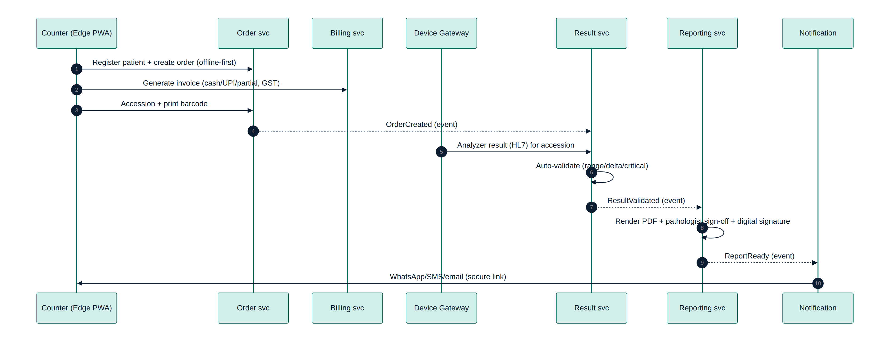
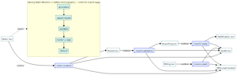
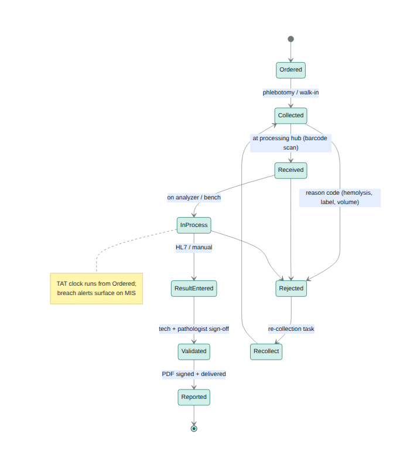
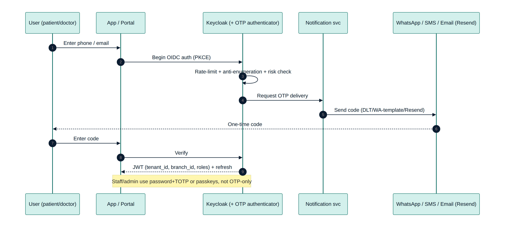
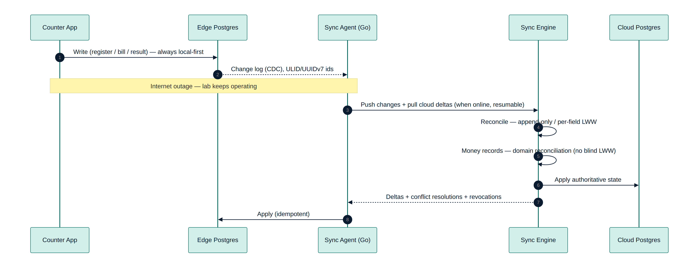
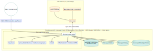

# DiagDesk — High-Level Design (HLD)

*System-level design for the DiagDesk platform. Companion to [LLD.md](LLD.md) (component internals) and
[data-model.md](data-model.md) (schema). Diagrams render from `diagrams/*.mmd` (Mermaid).*

---

## 1. Purpose & scope
An all-in-one, multi-tenant SaaS to run Indian diagnostic labs end-to-end — registration, billing, sample
tracking, analyzer interfacing, validation, reporting, B2B & patient experience — **offline-resilient** and
**India-region resident**. This HLD covers the MVP-core platform; V1/V2 modules extend the same architecture.

## 2. Goals & non-functional requirements (NFRs)
| Area | Target |
|---|---|
| **Availability** | Counter-critical paths keep working **offline**; cloud 99.9% |
| **Performance** | Registration/billing < 1s p95 at the counter (local-first) |
| **Scalability** | Multi-tenant to thousands of labs; **horizontally scalable to millions of records & high txn/min** — Citus sharding by `tenant_id`, time-partitioned tables, read replicas + CQRS/ClickHouse, Kafka write-buffering, PgBouncer. See [scalability-and-data-at-scale.md](scalability-and-data-at-scale.md). Large tenants isolatable to a dedicated shard/DB |
| **Security** | OIDC + RBAC/ABAC + Postgres RLS; mTLS; field-level PHI encryption; immutable audit |
| **Privacy/residency** | DPDP (consent, retention, 72-hr breach); **India-only data + CERT-In 180-day in-India logs** |
| **Compliance** | NABL QC artifacts, PC-PNDT (V2), ABDM (V2); **no referral-commission tooling** (see [ADR-007](../adr/007-no-referral-commission-tooling.md)) |
| **Observability** | OTel traces/metrics/logs; SLOs on the four golden journeys |
| **Capacity** | Sized & load-tested per throughput tier (k6) — see [capacity-and-load-testing.md](capacity-and-load-testing.md) |

## 3. Architecture overview
- **Right-sized microservices** on DDD bounded contexts (~12 at MVP), **hexagonal** per service.
- **Database-per-service** on PostgreSQL; **no shared DB**; multi-tenant via **`tenant_id` + Row-Level Security**.
- **Async events** (Kafka, transactional outbox + CDC) + **sagas** (Spring State Machine + Kafka choreography); gRPC for sync reads.
- **Offline-first edge** at each branch (k3s + local Postgres + Go sync agent + device gateway).
- **CQRS read models** for MIS; selective event sourcing for audit & sample lifecycle.

### System context (C4-L1)

### Container view (C4-L2)

## 4. Service catalogue (MVP core)
| Service | Responsibility |
|---|---|
| **API Gateway (Kong) + BFFs** | Edge routing, OIDC validation, rate-limit, WAF, tracing |
| **Identity & Access** | AuthN (Keycloak), users, roles, OTP/passkeys, tenant/branch claims |
| **Tenant & Org** | Organizations, branches, configuration, entitlements |
| **Patient (MPI)** | Master patient index, registration, dedup |
| **Catalog & Rate-Card** | Test master, panels, reference ranges, rate cards (incl. CGHS/TPA) |
| **Order & Workflow** | Orders, accessioning, sample tracking, TAT |
| **Result & Validation** | Result capture, auto-validation, multi-level sign-off |
| **Device Gateway** (Go) | HL7/ASTM analyzer interfacing |
| **Reporting** | Templates, PDF render, digital signature, delivery orchestration |
| **Billing** | Invoices, cash/partial/GST, payments, **B2B & Partner billing** (no commissions) |
| **Notification** | WhatsApp/SMS/email delivery, OTP transport |
| **Audit & Consent** | Hash-chained audit, DPDP consent, retention, DSAR |
| **Sync Engine** (Go) | Branch ⇄ cloud offline sync, conflict resolution |

> V1 adds Quality/Compliance, Inventory, Booking/Home-Collection, MIS, and **B2B & Partner Management**
> (compliant — institutional billing, receivables, referral *analytics*, doctor portal). V2 adds Interop
> (ABDM) and Radiology (RIS/PACS).

## 5. Key flows
**Walk-in journey** (the first vertical slice):

**Event & saga backbone** (Kafka topics + Spring State Machine order-to-report saga, Kafka choreography):

**Sample lifecycle & TAT** (state machine):

## 6. Data strategy
- **PostgreSQL** system of record (ACID, RLS, SQL MIS, JSONB for FHIR/flexible). MongoDB not adopted
  ([ADR-005](../adr/005-database-postgresql.md)).
- **Database-per-service**; every tenant-scoped table carries `tenant_id` (+ `branch_id`); **UUIDv7/ULID PKs**
  (edge-safe id generation).
- **CQRS read models** for analytics; **outbox** for reliable event publication.
- Full schema in [data-model.md](data-model.md); ERD:

## 7. Integration
- **Analyzers:** HL7/ASTM via the Device Gateway (pluggable per device), at the branch edge.
- **ABDM (V2):** FHIR care-context, ABHA linking, NHCX claims via the Interop service.
- **Payments:** Razorpay/UPI. **Messaging:** WhatsApp Business API + SMS (DLT) + email (Resend).

## 8. Security & observability
- **Security (defense in depth):** Keycloak OIDC (+OTP/passkeys), RBAC + OPA/ABAC + **Postgres RLS**, Vault
  secrets, Istio mTLS, field-level PHI encryption, rate-limiting + WAF/DDoS (AppTrana), hash-chained audit,
  DPDP + CERT-In. See [security-hardening.md](../security-hardening.md) and [adr/authentication.md](../adr/authentication.md).
- **OTP auth flow:**

- **Observability:** OpenTelemetry → Grafana LGTM + Sentry + PostHog; RED/USE + business metrics; SLOs &
  error budgets; correlation IDs across gRPC, Kafka and the edge sync boundary.

## 9. Offline-first & deployment
**Offline sync** (edge ↔ cloud, with money-record reconciliation):

**Deployment** (provider-agnostic managed, India-region + branch edge):

- **Cloud:** provider-agnostic managed, India-region — start on DigitalOcean Bangalore / Fly.io Mumbai; graduate
  to AWS Mumbai / Azure India (HIPAA BAA) or E2E / Yotta (sovereign) per contract. Managed K8s + Postgres + Kafka
  + object store; the stack stays portable (K8s + Postgres + S3 API) so the provider is a swap, not a rewrite;
  self-host Keycloak/Vault/observability ([ADR-004](../adr/004-hosting-and-data-residency.md)).
- **Edge:** k3s + local Postgres + Go agents at each branch; conflict-aware resumable sync
  ([ADR-003](../adr/003-offline-first-and-sync.md)).

## 10. Compliance constraints encoded in the design
- **No referral-commission/payout** anywhere — `referring_doctor` is a referral **source** for analytics only;
  a **guardrail blocks** attaching a payout to a referrer (see B2B flow in [LLD.md](LLD.md) & [data-model.md](data-model.md)).
- **DPDP/CERT-In:** consent service, India residency, 180-day in-India logs, 72-hr/6-hr breach runbook.
