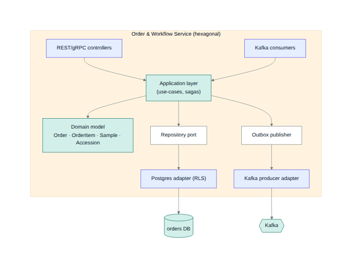
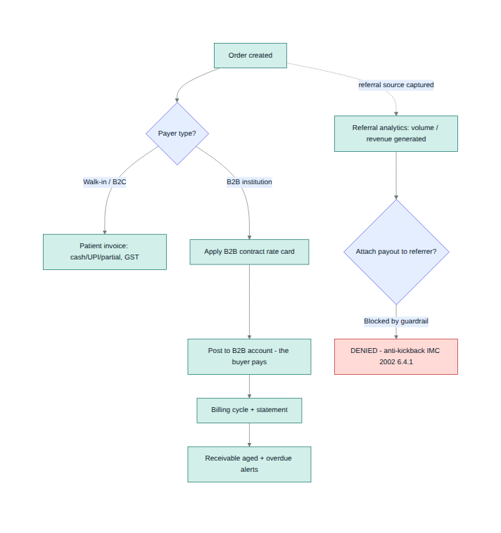

# DiagDesk — Low-Level Design (LLD)

*Component-level design for the MVP-core services. Companion to [HLD.md](HLD.md) and [data-model.md](data-model.md).
Each service follows the same **hexagonal** shape: REST/gRPC + Kafka adapters → application (use-cases/sagas) →
domain → repository/outbox ports → Postgres (RLS) + Kafka adapters. Endpoints are illustrative (`/v1`).*

### Component shape (representative — Order & Workflow)

**Cross-cutting conventions (every service):**
- IDs: **UUIDv7/ULID** (edge-safe). Tenant context: `tenant_id`/`branch_id` from the verified JWT → `SET
  app.tenant_id` → **RLS** on every query.
- Writes: **transactional outbox** (same Postgres tx) → CDC → Kafka. Consumers are **idempotent** (dedup on
  `idempotency_key` / event id).
- Errors: typed domain errors → RFC-7807 problem+json at the edge; retries with backoff on consumers; DLQ for
  poison messages. Every stateful action emits an **audit** event.

---

## 1. Identity & Access
- **Endpoints:** `POST /v1/auth/login` (OIDC PKCE start), `POST /v1/auth/otp/verify`, `POST /v1/users`,
  `POST /v1/roles`, `POST /v1/users/{id}/roles`.
- **Modules:** Keycloak adapter (realm = tenant claim), OTP authenticator (delegates delivery to Notification),
  RBAC/role mapper, OPA policy client.
- **Events:** `user.created`, `role.assigned` (out). **Owns:** `app_user`, `role`, `user_role` (Keycloak is
  source of credentials; profiles mirrored).
- **Auth policy:** patients → phone OTP (WhatsApp-first); staff/admin → password+TOTP or passkeys. See
  [adr/authentication.md](../adr/authentication.md) and the OTP sequence in [HLD §8](HLD.md).

## 2. Tenant & Org
- **Endpoints:** `POST /v1/tenants`, `POST /v1/branches`, `GET /v1/tenants/{id}/config`, entitlements.
- **Owns:** `tenant`, `branch`, configuration. Emits `tenant.created`, `branch.created`. Source of truth for
  the branch topology the edge nodes register against.

## 3. Patient (MPI)
- **Endpoints:** `POST /v1/patients`, `GET /v1/patients/search?phone=`, `POST /v1/patients/{id}/merge`.
- **Modules:** MPI matcher (phone/name/DOB fuzzy), dedup, ABHA link (V2). **Owns:** `patient`, `consent`
  (consent created at registration; gated by Audit/Consent policies).
- **Events:** `patient.registered`, `patient.merged`.

## 4. Catalog & Rate-Card
- **Endpoints:** `GET /v1/tests`, `POST /v1/panels`, `GET /v1/reference-ranges?test=&age=&sex=`,
  `POST /v1/rate-cards`, `GET /v1/price?test=&scheme=&partner=`.
- **Modules:** test master, panel expansion, reference-range resolver (age/sex/method), **rate resolver**
  (per branch / per B2B partner / per scheme — CGHS TMS 2.0, ECHS, TPA).
- **Owns:** `test`, `test_panel`, `panel_item`, `reference_range`, `specimen_type`, `container`, `rate_card`,
  `rate_card_item`, `report_template`.

## 5. Order & Workflow  *(see component diagram above)*
- **Endpoints:** `POST /v1/orders`, `POST /v1/orders/{id}/accession`, `GET /v1/worklist?status=`,
  `POST /v1/samples/{id}/event`.
- **Domain:** `Order`, `OrderItem`, `Sample`, `Accession`, `SampleEvent` (lifecycle state machine — see
  [HLD §5](HLD.md)). Computes TAT from `ordered_at`; raises breach alerts.
- **Events:** `order.created` (out, starts the Spring State Machine saga via Kafka choreography), `sample.rejected`, `sample.status.changed`.
  **Consumes:** `result.validated` (to advance state). **Owns:** `order`, `order_item`, `sample`, `sample_event`.
- **Compliance:** captures `referring_doctor_id` as a **source** only (no monetary field).

## 6. Result & Validation
- **Endpoints:** `POST /v1/results` (manual), `GET /v1/results/{orderItem}`, `POST /v1/results/{id}/validate`.
- **Modules:** result calculator (formulas/derived), **auto-validation** (range/delta/critical via reference
  ranges), multi-level sign-off (tech → pathologist), amendment/versioning.
- **Events:** `result.entered`, `result.validated` (out), `critical.flagged`. **Consumes:** analyzer results
  relayed from the Device Gateway. **Owns:** `result`, `result_value`, `validation`.

## 7. Device Gateway (Go, edge)
- **Function:** persistent HL7/ASTM sockets to analyzers; maps ORU→result codes/units/ranges; pushes results
  to Result svc (local-first at the edge, synced). Worklist download to analyzers.
- **Why Go:** many concurrent persistent sockets; small static binary on the branch node.

## 8. Reporting
- **Endpoints:** `GET /v1/reports/{orderId}`, `POST /v1/reports/{id}/deliver`.
- **Modules:** template engine, **PDF renderer**, **digital signature**, delivery orchestrator (→ Notification),
  preliminary/final states, version history. **Consumes:** `result.validated`. **Emits:** `report.ready`.
  **Owns:** `report`, `report_delivery`. PDFs stored in object storage; only a **secure expiring link** is sent.

## 9. Billing  *(incl. compliant B2B & Partner billing)*
- **Endpoints:** `POST /v1/invoices`, `POST /v1/invoices/{id}/payments`, `GET /v1/b2b/{account}/statement`,
  `GET /v1/b2b/receivables?aging=`.
- **Modules:** invoice builder (cash/UPI/partial, dues, **GST mixed exempt/taxable**), discount-with-approval,
  day-end reconciliation; **B2B account billing** (institution = buyer), billing cycles, **receivables aging**.
- **Compliance guardrail (hard rule):** the service **separates "customer billing" from "referral source"**;
  any attempt to attach a payout/commission to a `referring_doctor` is **rejected** and audit-logged. No
  commission/accrual/payout entities exist. B2B billing flow:

- **Events:** `invoice.created`, `invoice.paid`. **Owns:** `invoice`, `invoice_line`, `payment`,
  `b2b_partner`, `b2b_account`, `b2b_receivable`.

## 10. Notification
- **Endpoints:** `POST /v1/notify` (templated). **Channels:** WhatsApp Business API (auth-category templates),
  SMS (DLT-registered), email (**Resend**). Also delivers **OTP** for Identity. Tracks delivery status; retry +
  channel fallback. **Owns:** `notification`. PHI guardrail: report emails carry a **secure link, not PHI**.

## 11. Audit & Consent (DPDP)
- **Endpoints:** `POST /v1/consent`, `GET /v1/audit?entity=`, `POST /v1/dsar` (access/erasure).
- **Modules:** **hash-chained audit** (`prev_hash`→`hash`) with a verification job; consent store; retention
  scheduler; 72-hr/6-hr breach runbook hooks. **Consumes:** all domain events (for the audit trail).
  **Owns:** `audit_log`, `consent`.

## 12. Sync Engine (Go) + Edge
- **Function:** branch ⇄ cloud sync — change-log push/pull, **idempotent & resumable**; conflict resolution
  (append-only favored; per-field LWW with Lamport/vector clocks; **domain reconciliation for money records**);
  revocation/role reconciliation on reconnect (cached JWKS for offline JWT validation). Sequence in
  [HLD §9](HLD.md). See [ADR-003](../adr/003-offline-first-and-sync.md).

---

## V1/V2 services (pattern summary)
Same hexagonal shape and conventions. **V1:** B2B & Partner Management (extends Billing — analytics + portal,
no payouts), Quality & Compliance (IQC/L-J/Westgard/EQAS), Inventory (expiry/auto-reorder), Booking &
Home-Collection (Spring State Machine scheduling + Kafka choreography routing), MIS (CQRS read models). **V2:** Interop (ABDM HIP/FHIR/NHCX),
Radiology (RIS + light PACS/DICOM). Each owns its own tables (see [data-model.md](data-model.md) V1/V2 section).
