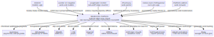
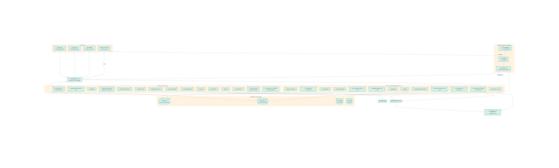

# MediCircle — High-Level Design (HLD)

*System-level design for the **MediCircle** platform — the five-sided India healthcare network
(**Diagnostic Centers · Doctors/Hospitals · Pharmacies · On-Demand Home-Care · Patients**).
**DiagDesk is the lab node, built to production depth.** This HLD brings the connective layer
(doctor/pharmacy/patient/home-care) up to the same depth and reconciles it with the program-wide
locked decisions in [medicircle-reconciliation.md](../medicircle-reconciliation.md).*

*Companion to the canonical [microservices.md](microservices.md) (service catalogue) and
[data-model.md](data-model.md) (schema). Diagrams render from `diagrams/*.mmd` (Mermaid).*

---

## 1. Purpose & scope
A five-sided, multi-tenant healthcare platform that connects diagnostic centers, doctors/hospitals,
pharmacies, on-demand home-care professionals, and patients on **one TypeScript/NestJS/PostgreSQL
backbone**. The **lab node (DiagDesk)** is offline-resilient and edge-deployed; the **connective layer**
runs cloud-side as a modular monolith that extracts services as load grows. The whole program is
**India-sovereign (no hyperscaler)**, **DPDP/ABDM/FHIR-aligned**, **compliant-economics only (no
referral commissions)**, and **AI assistive-only with mandatory doctor sign-off**.

Scope here is the system-level architecture across all five sides for R1→R3. Component internals belong
in the LLD; the schema lives in [data-model.md](data-model.md); the exact service list is
[microservices.md](microservices.md).

## 2. Goals & non-functional requirements (NFRs)
| Area | Target |
|---|---|
| **Availability** | Cloud control plane **99.9%**; **lab-node counter-critical paths keep working offline** (registration, billing, sample tracking, result capture) and reconcile on reconnect |
| **Performance** | Registration/billing **< 1s p95** at the lab counter (local-first); core API reads **p95 < 300ms**, writes **p95 < 800ms**; payment-webhook + notification dispatch async off the request path |
| **Scalability** | Multi-tenant to thousands of providers and millions of patients; stateless services horizontally autoscaled on CPU/queue depth; `tenant_id` + time-partitioned high-volume tables; read replicas + CQRS read models; Kafka write-buffering at the lab core |
| **Security** | Keycloak **OIDC** + RBAC/org-scope + **Postgres RLS**; mTLS between services; field-level PHI encryption; **immutable hash-chained audit**; Vault secrets |
| **Privacy/residency** | **DPDP** (consent-first, revocable, retention, 72-hr breach); **India-only data residency**; **CERT-In 180-day in-India logs**; **India-sovereign hosting, no hyperscaler** (E2E Networks primary / Yotta tier) |
| **Compliance** | **No referral-commission tooling** (ADR-007/010 — compliant economics only); ABDM/ABHA + **FHIR R4**; **AI assistive-only + mandatory doctor sign-off**; NMC 2023 anti-fee-splitting; GST-compliant invoicing; (lab) NABL QC; (R2+) telemedicine + e-pharmacy guardrails |
| **Money integrity** | **Integer paise** (`bigint`) end-to-end; **idempotent, transactional** payment/payout flows; transactional outbox; everything auditable |
| **Observability** | OpenTelemetry traces/metrics/logs; SLOs on the key journeys; correlation IDs across HTTP, Kafka, BullMQ and the edge-sync boundary |

## 3. Architecture overview
MediCircle is a **hybrid** of two complementary styles, joined by a shared event/outbox backbone:

- **Lab node (DiagDesk) — right-sized microservices + offline-first edge.** ~9 services on DDD
  bounded contexts, **database-per-service** on PostgreSQL, **no shared DB**, multi-tenant via
  **`tenant_id` + Row-Level Security**. **Async events** over **Kafka** (transactional outbox + CDC)
  with **Temporal** sagas for the order-to-report workflow. Each branch runs an **offline-first edge**
  (k3s + local Postgres + **Go** sync agent + **Go** device gateway) so counter-critical work survives
  connectivity outages.
- **Connective layer — cloud modular monolith (NestJS) + BullMQ.** Doctor/clinical, pharmacy,
  home-care, engagement, insurance, and most platform concerns start as **bounded-context modules**
  inside one deployable, with an internal event bus and **no cross-module DB access**. The module seams
  + outbox let high-load modules **extract to independent services later** without rework.
- **Domain-driven bounded contexts** with explicit boundaries; modules/services talk via APIs and
  events, never each other's tables.
- **Events + sagas** for side effects (notifications, AI analysis, payouts, deliveries, home-visit
  dispatch) — request paths stay fast and resilient; long-running cross-service workflows run as sagas.
- **CQRS read models** for MIS/analytics and discovery; selective event-sourcing for audit and the
  lab sample lifecycle.
- **Integer paise** money, **UUIDv7** PKs (edge-safe id generation), **transactional outbox** for
  reliable event publication — uniform across both styles.

### System context (C4-L1)

*Source: [diagrams/medicircle-context.mmd](diagrams/medicircle-context.mmd) — the five actor types,
the MediCircle platform, and the external integrations (Razorpay, WhatsApp, MSG91, FCM, Resend, 100ms,
Claude, sovereign OCR, ABDM/FHIR, Maps).*

### Container / service view (C4-L2)

*Source: [diagrams/medicircle-container.mmd](diagrams/medicircle-container.mmd) — client apps → API
gateway → connective monolith modules + lab-node microservices + workers + datastores
(PostgreSQL, Redis/Valkey, S3-compatible object store, OpenSearch) + the branch edge node.*

## 4. Service catalogue
Summarized from the canonical [microservices.md](microservices.md). **Start-as:** `service` = independent
microservice from day one; `module` = bounded-context module in the connective monolith, extractable
later. **Edge ✅** = also runs at the branch edge. Exact owned tables are in microservices.md / data-model.

### A. Platform & shared (every side)
| Service | Start-as | Edge | Responsibility |
|---|---|---|---|
| **API Gateway / BFF** (Kong + per-client BFFs) | service | ✅ | Edge routing, OIDC validation, rate-limit, WAF, WebSocket gateway, OpenAPI |
| **Identity & Access** (Keycloak-backed) | service | ✅ | Phone-OTP/JWT, sessions, device binding, RBAC + org-scope, role/permission catalogue |
| **Credentialing & Verification** | module | | KYC + council/license/NABL checks, background checks, approval queues — the trust backbone |
| **Organizations & Profiles** | service | ✅ | Centers, pharmacies, hospitals, branches, staff; doctor/patient/professional profiles; **MPI** |
| **Consent & Health Records** | module | | DPDP consent registry (revocable), ABHA linkage, **FHIR R4** adapter |
| **Notifications** | service | | Resend email · WhatsApp · MSG91 SMS-DLT · FCM push; templates, prefs, quiet hours |
| **Payments & Settlement** | service | | Payments, refunds, **payouts** (home-care, lawful B2B), split settlement, reconciliation — **no commission ledger** |
| **Billing & Invoicing** | service | ✅ | **GST** invoices/receipts, day-book/collections, returns, exportable financial reports |
| **Subscriptions & Entitlements** | module | | Provider SaaS plans, entitlements/feature-gating |
| **Audit & Admin** | service | ✅ | Immutable hash-chained audit, disputes, moderation, fraud monitoring |
| **Analytics / MIS** | module | | CQRS read-models + dashboards (referrals, conversion, revenue, TAT, home-care) |
| **Search & Discovery** | module | | OpenSearch discovery/ranking (labs, doctors, tests, content) |
| **Job Workers + Scheduler** | service | | BullMQ consumers + cron: reports, AI, payouts, delivery dispatch, OCR, expiry scans, statements |

### B. Lab node (DiagDesk) — offline-first edge + microservices
| Service | Start-as | Edge | Responsibility |
|---|---|---|---|
| **Catalog & Rate-Card** | service | ✅ | Test master, panels, reference ranges, packages, rate cards (CGHS/ECHS/TPA/B2B) |
| **Order & Workflow** | service | ✅ | Order lifecycle, unique patient linkage, accessioning, barcode sample tracking, TAT |
| **Result & Validation** | service | ✅ | Result capture (analyzer/manual), auto-validation, multi-level sign-off |
| **Device Gateway** (Go) | service | ✅ | HL7/ASTM analyzer interfacing at the branch edge |
| **Reporting** | service | ✅ | Templates + letterhead, PDF render + digital signature, delivery, print log + barcode handover |
| **Inventory** (labs & pharmacies) | service | ✅ | Reagents/consumables/vaccines/medicines, **batch + expiry (FEFO)**, test-kit consumption, reorder alerts |
| **Lab Quality (NABL)** | module | | IQC, Levey-Jennings, Westgard, EQAS, controlled docs, accreditation readiness |
| **Expenses** | module | ✅ | Provider expense tracking by category + reports |
| **Sync Engine** (Go) | service | ✅ | Branch ⇄ cloud change-log sync, conflict resolution, money-record reconciliation |

### C. Doctor / clinical
| Service | Start-as | Responsibility |
|---|---|---|
| **Associations & Contracts** | module | Doctor↔lab associations; **professional-service contracts (fixed/per_service — never per-referral)**; B2B agreements. **Replaces the commission engine.** |
| **Consultations & Prescriptions** | module | Visits/records, e-prescription (dosage/frequency/duration), follow-up scheduling |
| **Teleconsultation** | module | 100ms video, secure join links, waiting room, in-call notes, consent-gated recording |
| **AI Decision Support** | service | Claude-based cues from age/sex + structured results; **assistive only + mandatory doctor sign-off**; versioned, audited; pgvector retrieval |
| **Prescription Integrity** | module | E-signed, ABHA-linked Rx; reuse-prevention registry; Schedule H/H1/X + narcotics guardrails; anti-forgery |

### D. Pharmacy
| Service | Start-as | Responsibility |
|---|---|---|
| **Medicine Master & Brand↔Generic** | module | Medicine catalogue, brand↔composition mapping, substitute suggestions |
| **Pharmacy Fulfilment & Delivery** | module | E-prescription → order, substitution, payment link, pickup/home delivery (radius), agent assignment, tracking + POD |

### E. On-demand & home-care
| Service | Start-as | Responsibility |
|---|---|---|
| **Home Care & On-Demand** | service | Professional onboarding (via Credentialing), service catalog, **booking + matching/dispatch**, availability/on-call, geo **check-in/out** + visit OTP, **care plans**, visit records → patient history, payouts (via Payments), SOS/ratings; reuses matching for **at-home sample collection** |

### F. Engagement & insurance
| Service | Start-as | Responsibility |
|---|---|---|
| **Engagement** | module | Health content/advisories, lab-owned packages (no RMP kickback), campaigns, health camps; consent + opt-out; moderation |
| **Insurance** | module | Ailment-based recommendations, **consented** medical-summary sharing → leads; (R3+) cashless/TPA, PM-JAY, NHCX |

> **Build order:** R1 ships the platform/shared services + the lab node + Associations & Contracts; R2
> adds Analytics/Search + clinical + pharmacy + home-care booking/visits; R3 adds NABL QC, home-care
> care-plans/payouts, engagement, insurance, deeper Consent/FHIR. See microservices.md build order.

### G. Clinic & Hospital (HIS) — dedicated enterprise track
MediCircle now includes a **Clinic edition (OPD operations)** and a **Hospital edition (full HIS)** as a
**dedicated enterprise track** (not folded into the SMB R1–R3 timeline). A single **`encounter`** spine
(FHIR `Encounter`-aligned) unifies **OPD · IPD · ER**, threading orders, notes, meds, bills, and the
discharge summary; the **lab node serves as the in-house LIS** (and RIS/PACS as in-house radiology). Each
hospital chooses **full MediCircle HIS or HL7/FHIR integration** with its existing systems. New services land
as **Group G** (G1 Clinic Operations, G2 ADT, G3 Bed/Ward, G4 IPD & Nursing/CPOE/eMAR, G5 OT & Surgery, G6
Hospital Billing & TPA/Cashless, G7 MRD & Clinical Coding, G8 Hospital Pharmacy & Formulary). Conventions
(integer paise, RLS, AI assistive + sign-off, FHIR) carry over unchanged. Full detail:
[clinic-hospital-his.md](clinic-hospital-his.md).

## 5. Core end-to-end flows
All money is **integer paise** and idempotent; **no commission accrues anywhere** — economics are
**SaaS subscriptions + patient transaction fees + home-care take-rate + lawful B2B + consented
insurance lead-gen** (see §4 of the reconciliation doc).

### 5.1 Referral → test → report (the lab spine)
Doctor creates a test order → patient notified with payment link → patient pays → **idempotent payment
webhook** flips the order to *paid* → lab notified → sample accessioned + barcoded → analyzer results
in via the **Device Gateway** (or manual capture) → auto-validation + multi-level sign-off → **Reporting**
renders a signed PDF → delivered to doctor (with **AI cues, sign-off required**) and patient (WhatsApp/app).
A **Temporal saga** owns order-to-report; the **Sync Engine** lets every step run at the edge offline and
reconcile later. **No commission step** — the referring doctor is a **referral source for analytics
only**, and a guardrail blocks attaching any payout to a referrer. Lawful B2B is billed institution-as-buyer.

### 5.2 E-prescription → pharmacy → delivery
Doctor prescribes (brand or generic) → **brand↔generic mapping** offers substitutes → Rx routed to an
associated pharmacy → stock check (Inventory, FEFO) → patient payment link → pickup or **home delivery**
(radius check via Maps) → agent assigned → live tracking + proof-of-delivery → inventory decremented by
batch/expiry. **Prescription Integrity** e-signs/ABHA-links the Rx and enforces the reuse-prevention
registry and Schedule H/H1/X guardrails. Pharmacy revenue is a transaction fee — **no commission**.

### 5.3 Teleconsult & follow-up
Doctor initiates → **100ms** video room created → secure join link to patient (WhatsApp/push) → both join
→ in-call notes → post-call: revise prescription or order more tests (re-enters 5.1/5.2). Follow-ups
scheduled with reminders. Recording is **consent-gated**. Consultation fee billed to patient — **no
commission**.

### 5.4 Home-visit booking → matching → dispatch (the home-care pillar)
Patient (or doctor on their behalf) requests an on-call or scheduled visit → service + address + time →
the **matching engine** ranks verified professionals by type, proximity, availability and rating →
offer/accept with **reassignment on decline** → professional travels → **geo check-in** → visit performed,
notes/vitals captured → **geo check-out + patient OTP** confirmation → payment captured → **professional
payout queued** (via Payments — a lawful per-visit payout to the professional who did the work, **not a
referral commission**) → visit record written to patient history. **Care plans** schedule recurring visits
with reminders; realtime status flows over WebSockets. The same engine powers **at-home sample collection**.

### 5.5 Hospital admission → discharge (HIS — enterprise track)
**admission → CPOE/eMAR/nursing → OT → discharge summary (ICD) → final bill + TPA/cashless** — all hung off
one FHIR-aligned `encounter`. Detail in [clinic-hospital-his.md](clinic-hospital-his.md).

### 5.6 Provider operations & billing
Each provider portal (Doctor/Hospital · Lab · Pharmacy · Admin) runs day-to-day operations. Completed
orders/visits generate **GST-compliant invoices/receipts**, feed the day-book/collections, handle refunds
and returns (credit notes), and produce exportable financial reports — all in **Billing & Invoicing**.
Inter-provider economics use **professional-service contracts (fixed/per_service)** and **B2B-buyer
billing** — **never per-referral commission**. Referral relationships surface only as **analytics**.

## 6. Data strategy
- **PostgreSQL 16** (+ pgvector, pg_trgm) is the system of record (ACID, RLS, SQL MIS, JSONB for
  FHIR/flexible payloads). MongoDB not adopted.
- **Lab node: database-per-service**; **connective layer: schema-per-context** inside the monolith
  (extract to its own DB when a module becomes a service). Every tenant-scoped table carries `tenant_id`
  (+ `branch_id`) enforced by **Row-Level Security**; **UUIDv7** PKs for edge-safe id generation.
- **Cache/queue:** Redis/Valkey — cache, sessions, rate limits, **BullMQ** queues, WebSocket pub/sub.
- **Object store:** **S3-compatible** (sovereign) buckets for `reports/`, `prescriptions/`, `content/`,
  `kyc/`; presigned URLs; server-side encryption; lifecycle policies.
- **Search:** OpenSearch for discovery (labs, doctors, tests, content). **Vectors:** pgvector for AI
  retrieval over reference ranges / clinical knowledge.
- **Events:** **transactional outbox** + CDC → **Kafka** (lab core) and the in-process event bus +
  BullMQ (connective layer); **CQRS read models** for MIS.
- **Health records:** **FHIR R4** resources mapped from internal models via a FHIR adapter for ABDM.
- **Data classification:** PII / PHI / financial / operational — each with its own retention, encryption,
  and access rules. Full schema: [data-model.md](data-model.md).

## 7. Integration architecture (sovereign providers)
All third-party calls go through **anti-corruption adapter layers** with retries, circuit breakers,
timeouts, and webhook signature verification — so providers can be swapped without touching domain logic.

| Capability | Provider (primary / alt) | Pattern |
|---|---|---|
| Payments + payouts | **Razorpay** (+ Route for lawful splits) / Cashfree | Hosted checkout + **idempotent webhooks**; per-visit + B2B payouts (no commission) |
| WhatsApp + templates | Gupshup / Meta Cloud API | Template messages + media; delivery callbacks |
| SMS + OTP (DLT) | **MSG91** / Kaleyra | DLT-registered templates |
| Push | **FCM** | Device tokens per user |
| Email | **Resend** | Transactional (sovereign-aligned; **not SES**) |
| Video | **100ms** / Agora | Room + token issuance; client SDKs; event webhooks |
| AI cues | **Anthropic Claude** | Server-side, structured prompts; **PII-minimized, no raw PHI beyond consented scope**; assistive-only |
| OCR | **Sovereign/self-hosted** (Tesseract/Docling on the India cluster) | Async report-PDF parse (**not Textract**) |
| Health records | **ABDM / ABHA + FHIR R4** | Consent-driven linkage & exchange |
| Maps/geo | Google / OLA Maps | Geocoding + delivery/home-care radius & routing |

## 8. Security architecture
- **AuthN:** **Keycloak OIDC** — phone-OTP + short-lived JWT access + rotating refresh tokens; device binding.
- **AuthZ:** **RBAC + org-scoping** (a lab admin only sees their org) with policy guards on every endpoint,
  backed by **Postgres RLS** row-level filters; ABAC/OPA where finer-grained policy is needed.
- **Transport/at-rest:** TLS 1.2+, mTLS between services, AES-256 at rest, **field-level encryption** for
  the most sensitive PHI; **Vault**-managed keys (**not Secrets Manager**).
- **Consent enforcement** at the data-access layer for any cross-party sharing (DPDP, revocable).
- **Webhooks:** signature verification + idempotency keys.
- **Audit:** **immutable, hash-chained** append-only audit for clinical/financial/consent events.
- **Threat controls:** rate limiting, WAF/DDoS, input validation, output encoding, OWASP ASVS L2.
- **AI guardrails:** assistive-only, **mandatory doctor sign-off**, versioned + audited prompts/outputs.

## 9. Deployment topology (India-sovereign cloud + branch edge)
- **Cloud:** **India-sovereign CSP — E2E Networks primary / Yotta tier** — managed Kubernetes + managed
  PostgreSQL + S3-compatible object store + Valkey + OpenSearch; **self-host Keycloak, Temporal, Vault,
  Kafka and the observability stack**. **No hyperscaler — no AWS/EKS/RDS/S3/CloudFront/Textract/SES.**
  CDN/edge via an India provider. Multi-zone where the tier supports it; PITR backups + read replicas.
- **Edge (lab node):** **k3s + local Postgres + Go sync agent + Go device gateway** at each branch;
  counter-critical paths run offline and reconcile via conflict-aware, resumable sync.
- **Orchestration/IaC/CI-CD:** Docker containers on managed K8s (k3s at the edge); Terraform; GitHub
  Actions → build, test, scan, deploy; dev → staging → production with ephemeral PR preview envs.

## 10. Observability & reliability
- **Telemetry:** OpenTelemetry traces + Prometheus metrics + Grafana (LGTM) dashboards + Loki logs +
  Sentry errors + PostHog product analytics. RED/USE + business metrics.
- **SLOs:** cloud API availability 99.9%; report-delivery success; payment-webhook success; home-visit
  dispatch success; edge-sync convergence. Error budgets + burn-rate alerts.
- **Correlation:** correlation IDs across HTTP, gRPC, Kafka, BullMQ and the **edge-sync boundary**.
- **Resilience:** retries with backoff, DLQs for failed jobs, circuit breakers, graceful degradation
  (AI/teleconsult optional; the core referral/lab path must stay up).
- **DR:** automated backups, PITR, multi-zone failover where available; documented runbooks; **CERT-In
  180-day in-India log retention** and a **72-hr breach** procedure.

## 11. Scalability strategy
- Stateless API/worker pods → horizontal autoscaling on CPU/queue depth.
- Read replicas for reporting/analytics; connection pooling (PgBouncer); cache catalog/discovery in Redis.
- Partition high-volume tables (orders, notifications, audit_logs, sample_events) by month; large tenants
  isolatable to a dedicated shard/DB; **Kafka write-buffering** at the lab core absorbs analyzer/result bursts.
- CDN + presigned URLs offload report/prescription media.
- **Extraction path:** the connective monolith's high-load modules (reports-adjacent, notifications,
  payments, pharmacy, home-care) **extract to independent services** when load/team size justifies it — the
  outbox + event bus already isolate the seams, mirroring how the lab node already runs as services.

---

> Low-level contracts, state machines and schemas: see the LLD and [data-model.md](data-model.md).
> Canonical service list: [microservices.md](microservices.md). Program decisions:
> [medicircle-reconciliation.md](../medicircle-reconciliation.md).
