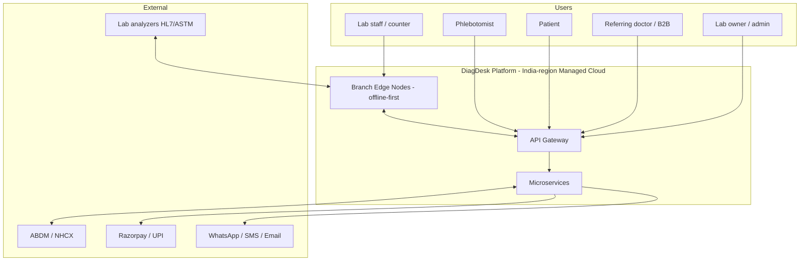
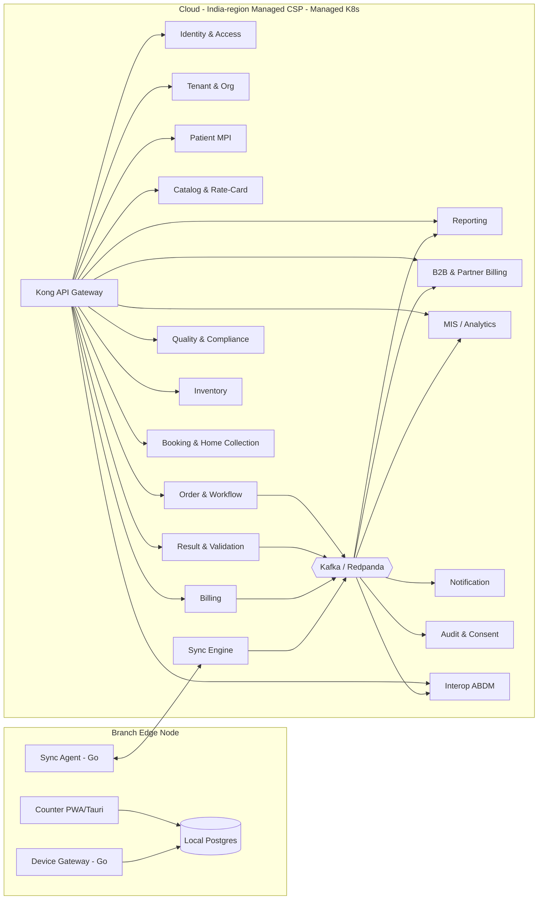
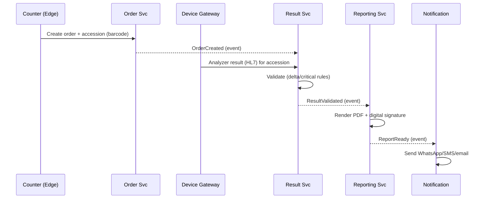
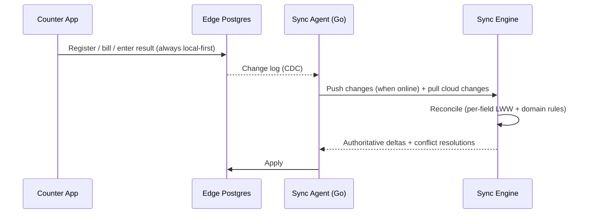

# DiagDesk — Technical Architecture

*Companion to [tech-stack.md](tech-stack.md). Microservices, PostgreSQL, API Gateway, clean code,
observability + security from day 1.*

---

## 1. Architecture principles

1. **Right-sized microservices, not nano-services.** Services map to **DDD bounded contexts**. Start with a
   modest set (MVP ~10 services); split further only when a context proves it needs independent scaling or
   release cadence. **Avoid the distributed monolith** — no shared database across services, no synchronous
   call chains where an event will do.
2. **Database-per-service.** Each service owns its PostgreSQL schema/instance. No cross-service SQL; data is
   shared via APIs and events only.
3. **Multi-tenant by `tenant_id` + Postgres Row-Level Security (RLS).** Tenant = lab organization; branches
   are sub-units. RLS is enforced in every service's DB; the gateway and services propagate a verified
   tenant claim. Large tenants can be promoted to a dedicated DB without code change.
4. **Offline-first at the edge.** Counter-critical operations (registration, barcode, billing, result entry)
   run on a **branch edge node** and sync to cloud — the product's core differentiator.
5. **Clean code = hexagonal (ports & adapters) per service.** Domain logic is framework-agnostic; HTTP, DB,
   Kafka, and FHIR are adapters. CQRS read models where reads and writes diverge (MIS, dashboards).
   Event sourcing **selectively** for the audit log and sample lifecycle.
6. **Security & observability are platform primitives**, wired into the service template from commit #1 —
   never retrofitted.
7. **DPDP/NABL by design.** Consent, immutable audit, retention, and India data residency are first-class.

---

## 2. System context (C4 — Level 1)

---

## 3. Service decomposition (C4 — Level 2, containers)

Grouped by role; **phase tags** align to [roadmap.md](roadmap.md). Items marked *(module first)* begin as a
module inside a neighboring service and split out when justified.

### Platform / cross-cutting
| Service | Responsibility | Phase |
|---|---|---|
| **API Gateway (Kong)** + per-client **BFFs** | Edge routing, OIDC token validation, rate-limit, WAF, request tracing | MVP |
| **Identity & Access** (Keycloak-backed) | AuthN, users, roles, MFA, tenant/branch claims | MVP |
| **Tenant & Org** | Organizations, branches, configuration, rate-plan/entitlements | MVP |
| **Notification** | WhatsApp/SMS/email delivery, templates, DLT compliance | MVP |
| **Audit & Consent (DPDP)** | Hash-chained immutable audit log, consent records, data-subject rights, retention | MVP |
| **Sync Engine** (Go) | Branch ⇄ cloud offline sync, conflict resolution | MVP |

### Core lab domain
| Service | Responsibility | Phase |
|---|---|---|
| **Patient (MPI)** | Master patient index, registration, dedup/matching | MVP |
| **Catalog & Rate-Card** | Test master, panels, per-branch/per-partner/per-scheme pricing (CGHS TMS 2.0) | MVP |
| **Order & Workflow** | Orders, accessioning, **sample tracking** *(module first)*, TAT | MVP |
| **Result & Validation** | Result capture, multi-level validation, delta/critical checks | MVP |
| **Device Integration Gateway** (Go) | HL7/ASTM analyzer interfacing, result ingest | MVP |
| **Reporting** | Report templates, PDF render, digital signature, delivery orchestration | MVP |
| **Billing & Invoicing** | Invoices, partial/cash/dues, GST mixed exempt/taxable, payments | MVP |
| **B2B & Partner Billing** | Institutional rate contracts, B2B credit ledger & receivables aging, reference-lab outsourcing, referral-source analytics (no payouts — anti-kickback compliant) | V1 |
| **Quality & Compliance** | NABL QC, L-J charts, Westgard, IQC/EQAS, rejection tracking | V1 |
| **Inventory** | Reagents/consumables, expiry alerts, auto-reorder | V1 |
| **Booking & Home-Collection** | Scheduling, phlebotomist assignment + routing (Spring State Machine) | V1 |
| **MIS / Analytics** | CQRS read models: TAT, QC, revenue dashboards | V1 |
| **Interop (ABDM HIP)** | ABHA linking, FHIR care-context, NHCX claims | V2 |
| **Radiology (RIS)** | Modality worklist, structured reporting, PACS/DICOM | V2 |

---

## 4. Data architecture

- **PostgreSQL 16**, one logical database per service. No service reads another's tables.
- **Multi-tenancy:** every tenant-scoped table carries `tenant_id`; **RLS policies** filter by the
  `tenant_id` set from the verified JWT claim (`SET app.tenant_id`). Branch scoping via `branch_id`.
- **Consistency across services:** **transactional outbox** + **Debezium CDC** → Kafka. Eventual consistency
  by default; **Saga** via **Spring State Machine** (a state machine per service for flows like
  order→billing→report) with **Kafka choreography** carrying state changes between services. **Idempotency
  keys** (ULID/UUIDv7) on all state-changing endpoints and consumers make transitions safe to replay.
- **CQRS read models:** MIS/Analytics builds denormalized projections from events for fast dashboards
  (TAT/QC/revenue) without burdening write services.
- **Audit log:** append-only, **hash-chained** (each row references prior hash) for tamper evidence — serves
  both DPDP and NABL audit-trail requirements; archived to WORM object storage.
- **Edge data:** local Postgres holds the branch's working set; **logical replication / change-log sync**
  reconciles with cloud (see §6).
- **Retention:** per-purpose retention policies (DPDP) enforced by scheduled jobs; PHI fields encrypted at
  column level.

---

## 5. Communication & API design

- **External APIs:** REST + **OpenAPI 3** contracts, versioned (`/v1`), through Kong. **FHIR R4** for
  ABDM/EHR interop. Webhooks for partners.
- **Internal sync:** **gRPC** (typed, fast) for service-to-service queries.
- **Internal async:** **Kafka/Redpanda** event backbone; events documented with **AsyncAPI**. Outbox pattern
  guarantees at-least-once publish.
- **Contract testing:** **Pact** (consumer-driven) in CI so services evolve without breaking consumers.
- **BFF pattern:** thin backend-for-frontend per client (counter, patient app, phlebotomist app, admin) to
  shape payloads and avoid chatty clients.

### Example: order → report → delivery (sequence)

---

## 6. Offline-first sync (the differentiator)

- **Edge node:** lightweight **k3s** (or Docker Compose) running the counter app, a local Postgres, the Sync
  Agent, and the Device Gateway. Lab keeps operating through internet outages.
- **Conflict strategy:** mostly **append-only/insert workloads** (orders, results) → low conflict.
  Mutable records use **per-field last-write-wins with vector/Lamport timestamps**, escalated to
  **domain-specific reconciliation** for money-touching records (billing) so payments never silently merge
  incorrectly.
- **ID strategy:** **UUIDv7/ULID** generated at the edge to avoid central-sequence dependency.
- **Ordering guarantees:** sync is idempotent and resumable; partial syncs are safe.

> This is real engineering complexity — it is the moat. Scope the MVP conflict model tightly (favor
> append-only flows) and expand carefully.

---

## 7. Security from day 1

| Concern | Control |
|---|---|
| **AuthN** | Keycloak OIDC; short-lived JWT access + rotating refresh; MFA for staff/admin |
| **AuthZ** | RBAC (roles) + **OPA/ABAC** policies (externalized) + **Postgres RLS** as the last line of tenant isolation |
| **Tenant isolation** | Verified `tenant_id`/`branch_id` claims propagated gateway → service → DB (RLS); defense in depth |
| **Transport** | TLS 1.3 everywhere; **mTLS between services** via Istio |
| **Data at rest** | Disk/volume encryption; **column-level/field encryption** for PHI/PII (Tink or `pgcrypto`); key mgmt in **Vault** |
| **Secrets** | Vault dynamic secrets; no secrets in env files or images |
| **Edge / network** | Zero-trust, private subnets, **WAF** at the edge (Kong/Cloudflare); branch nodes hold minimal data, encrypted, remotely revocable |
| **Audit** | Immutable hash-chained audit log (DPDP + NABL); access logging on PHI |
| **DPDP** | Consent service (multilingual notices), purpose-based retention, **72-hr breach workflow**, data-subject access/erasure APIs, **India-only data residency** |
| **CERT-In** | **180-day logs retained within India** (the self-hosted Grafana/Loki stack satisfies this), **6-hour incident reporting** runbook |
| **Supply chain** | CI gates: Semgrep (SAST), OWASP ZAP (DAST), Trivy (image/deps), **SBOM via Syft**, **cosign image signing**, gitleaks, Dependabot; least-privilege IAM |
| **App hardening** | Input validation at boundaries, output encoding, parameterized queries (no string SQL), rate limiting, idempotency, OWASP ASVS as the checklist |

---

## 8. Observability from day 1

- **One standard: OpenTelemetry** SDKs in every service → **OTel Collector** → **Grafana LGTM**
  (**L**oki logs, **G**rafana, **T**empo traces, **M**imir/Prometheus metrics). All self-hosted in India.
- **Traces:** distributed tracing with a **correlation/trace ID** stamped at the gateway and propagated
  through gRPC/Kafka (incl. across the edge sync boundary).
- **Metrics:** **RED** (rate/errors/duration) per service + **USE** for resources; business metrics
  (TAT, samples rejected, reports delivered, B2B receivables accuracy).
- **Logs:** structured JSON, trace-correlated, PII-scrubbed.
- **SLOs & error budgets** per critical journey (registration, result delivery, billing); alerting via
  **Alertmanager / Grafana OnCall**.
- **Errors:** **Sentry** (exceptions + release health). **Product analytics:** **PostHog** (funnels,
  retention, feature flags).
- **Health:** liveness/readiness probes, synthetic checks on the golden paths, edge-node heartbeat + sync-lag
  dashboards.

---

## 9. Infrastructure & delivery

> Hosting is **provider-agnostic managed, India-region** — see [hosting-india.md](hosting-india.md) and
> [ADR-004](adr/004-hosting-and-data-residency.md) for the provider evaluation and compliance basis. Start on
> **DigitalOcean Bangalore / Fly.io Mumbai** (cheap/fast); graduate per contract to **AWS Mumbai / Azure
> India** (explicit HIPAA BAA, broadest managed set) or **E2E Networks / Yotta** (India-sovereign / GovCloud /
> MeitY-STQC tier). The architecture is kept portable so the provider is a swap, not a rewrite; the final
> provider is an open decision (TBD).

- **Cloud/region:** **provider-agnostic managed CSP, India-region** (start on DigitalOcean Bangalore / Fly.io
  Mumbai; graduate to AWS Mumbai / Azure India or E2E / Yotta per contract), pinned to an India region for
  DPDP residency + CERT-In in-India logs.
- **Compute:** **CSP-managed Kubernetes** in cloud; **k3s** on branch edge nodes.
- **Managed from the CSP:** **managed PostgreSQL** (per service); **S3-compatible object storage** + **MinIO**
  at edge; **managed Kafka** and **managed Redis/Valkey** where the provider offers them.
- **Self-hosted on the managed K8s** (portable across providers): **Keycloak, Vault**, the
  **Grafana/Loki/Tempo/Mimir** observability stack, and **Kafka/Redis** where the CSP doesn't manage them.
  **OpenSearch** self-hosted for search.
- **IaC:** **Terraform** (CSP provider/API). **GitOps:** **ArgoCD**. **CI/CD:** **GitHub Actions**
  (build → test → scan → sign → deploy), trunk-based with feature flags.
- **Repo:** **Nx monorepo** holding shared OpenAPI/AsyncAPI/proto contracts, the service template, and shared
  libs (auth, telemetry, tenancy) so every new service inherits security + observability by default.
- **Environments:** dev → staging → prod, ephemeral PR preview envs; blue-green/canary deploys.

---

## 10. Clean-code & engineering practices

- **DDD + hexagonal architecture** per service; domain layer free of framework/IO.
- **Service template** ("golden path") preloaded with OTel, Keycloak auth, RLS-aware DB access, outbox, OPA,
  health checks, structured logging, Dockerfile, CI pipeline — clone-to-start.
- **Testing pyramid:** unit → integration (**Testcontainers** for real Postgres/Kafka) → **Pact** contract →
  **Playwright** E2E → **k6** load/soak (incl. offline-sync chaos tests).
- **Quality gates:** SonarQube/Semgrep, coverage thresholds, conventional commits, semantic versioning,
  ADRs (architecture decision records) checked into the repo.
- **API governance:** Spectral lint on OpenAPI; backward-compat checks in CI.

---

## 11. Phase-aligned build order

1. **Foundation (before features):** Nx monorepo + service template, Kong, Keycloak, Vault, Postgres+RLS,
   Kafka, OTel→Grafana, CI/CD with security scans, edge-node + Sync Engine skeleton.
2. **MVP services:** Identity, Tenant, Patient, Catalog/Rate-Card, Order/Workflow (+sample), Result,
   Device Gateway, Reporting, Billing, Notification, Audit/Consent — all offline-capable at the edge.
3. **V1:** B2B & Partner Billing, Quality & Compliance, Inventory, Booking & Home-Collection (Spring State Machine), MIS.
4. **V2:** Interop (ABDM HIP/FHIR/NHCX), Radiology (RIS) + PACS/DICOM.

---

## 12. Key risks & guardrails

- **Microservice over-decomposition** → start with ~10 services; keep sample/result close to Order initially.
- **Distributed-transaction sprawl** → prefer events + sagas; reserve synchronous chains for true read needs.
- **Offline sync on money records** → domain reconciliation, never blind LWW for billing.
- **ABDM certification lead time** (sandbox → WASA → NHA) → start the Interop track early in V2.
- **Operating a full self-hosted platform** (Kafka, Keycloak, Vault, LGTM) is real toil for a small
  team → prefer the provider's managed equivalents (managed Kafka/Redis, Grafana Cloud) **in an India region**
  where residency allows, trading cost for ops time.

---

## 13. Decisions to confirm

1. **Hosting provider** — locked posture is **provider-agnostic managed, India-region** (start on DigitalOcean
   Bangalore / Fly.io Mumbai; graduate to AWS Mumbai / Azure India or E2E / Yotta per contract). The specific
   start provider is an open decision (TBD, founders decide within days) — see [ADR-004](adr/004-hosting-and-data-residency.md).
2. **Managed vs self-hosted** platform components (Kafka/Keycloak/Vault/observability) — cost vs ops toil.
3. **Repo strategy** — Nx monorepo (recommended for a small team) vs polyrepo.

> **Locked (no longer open):** primary backend is **Java 21 + Spring Boot 3** (Go for the Device Gateway +
> Sync Engine; TypeScript frontend/mobile only) — [ADR-006](adr/006-backend-language.md); sagas via **Spring
> State Machine + Kafka choreography** (no Temporal); service mesh is **Istio**.
